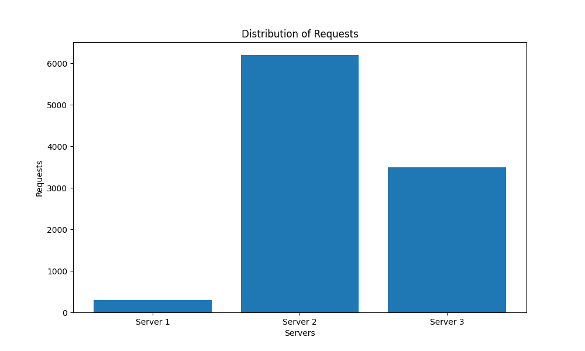

# Load Balancer Performance Analysis

## Setup Instructions

### Prerequisites

Ensure you have the following installed on your machine:
- Ubuntu OS
- Docker
- Docker Compose

### Installing Docker on Ubuntu

1. **Update your package list and install dependencies**:
    ```sh
    sudo apt-get update
    sudo apt-get install \
        ca-certificates \
        curl \
        gnupg
    ```

2. **Add Docker's official GPG key**:
    ```sh
    sudo install -m 0755 -d /etc/apt/keyrings
    curl -fsSL https://download.docker.com/linux/ubuntu/gpg | sudo gpg --dearmor -o /etc/apt/keyrings/docker.gpg
    sudo chmod a+r /etc/apt/keyrings/docker.gpg
    ```

3. **Set up the Docker repository**:
    ```sh
    echo \
      "deb [arch=$(dpkg --print-architecture) signed-by=/etc/apt/keyrings/docker.gpg] https://download.docker.com/linux/ubuntu \
      $(lsb_release -cs) stable" | sudo tee /etc/apt/sources.list.d/docker.list > /dev/null
    ```

4. **Install Docker Engine**:
    ```sh
    sudo apt-get update
    sudo apt-get install docker-ce docker-ce-cli containerd.io docker-buildx-plugin docker-compose-plugin
    ```

5. **Verify that Docker Engine is installed correctly**:
    ```sh
    sudo docker run hello-world
    ```

### Setting Up the Project Manually

1. **Clone the repository**:
    ```sh
    git clone <repository-url>
    cd <repository-directory>
    ```

2. **Build and start the Docker containers**:
    ```sh
    docker-compose up -d
    ```

## For automated deployment of the project
Navigate to the project root directory where your docker-compose.yml and Makefile are located and run the following commands:

# Build the Docker images
make build

# Start the containers
make up

# To view logs
make logs

# To stop the containers
make down

# To clean up everything
make clean

# To restart the containers
make restart


## Running the Performance Tests

To run the performance tests and generate the charts, follow these steps:

1. **Ensure that the load balancer and server containers are running**:
    ```sh
    docker-compose up -d
    ```

2. **Run the performance test script**:
    ```sh
    python performance_test.py
    ```

3. **View the generated charts in the `charts` folder**.

The test script will send 10,000 requests to the load balancer, collect the responses, and generate the charts showing the request distribution across different server counts.

# Evaluation:

A Python script was used to send 10,000 requests to the API endpoint. The responses were analyzed to extract the server number handling each request, providing insights into the request distribution across servers.

### Experiment 1:

10,000 asynchronous requests were launched on **server_count = 3** server containers, and the request count handled by each server instance is shown below.


The chart reveals that server 3 handled more than 50% of the total requests. The hash function in the load balancer distributes requests unevenly across servers, resulting in an imbalanced distribution.

When launched on **server_count = 2** server containers, the bar chart showed that server 1 handled over 80% of the requests.


For **server_count = 4** servers, the chart indicates that servers 1 and 2 handled over 80% of the requests collectively.


With **server_count = 5** servers, the chart showed that servers 1, 2, 3, and 4 handled a similar number of requests, while server 5 handled less than 10% of the total.


Finally, when launched on **server_count = 6** server containers, the bar chart revealed that all servers handled a similar percentage of the total requests.


### Conclusion:
The results demonstrate that as the number of servers increases, the hash function in the load balancer distributes the requests more evenly across servers, reducing the imbalance.

### Experiment 2:

10,000 asynchronous requests were launched on **server_count = 3** server containers using a modified hash function, and the request distribution is presented below.



The chart shows that server 2 handled more than 50% of the requests, indicating an uneven distribution.

With **server_count = 2** servers, the chart revealed that server 1 handled over 80% of the requests.


When launched on **server_count = 4** server containers, the chart below shows that servers 1 and 2 handled over 80% of the requests collectively.


With **server_count = 5** servers, the line chart indicated that servers 1, 2, 3, and 4 handled a similar number of requests, while server 5 handled less than 10% of the total.


Finally, for **server_count = 6** servers, the chart reveales that all servers handled a similar percentage of the total requests.


The results suggest that while the modified hash function distributes the load evenly for a smaller number of servers, the distribution becomes skewed as the number of servers increases, with some servers handling significantly fewer requests than others.
